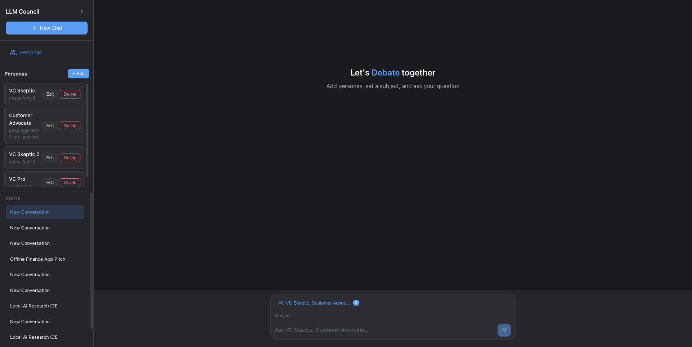

# LLM Council 2.0



Instead of asking a single LLM, assemble your own **LLM Council**: multiple models deliberate together, review each other's responses anonymously, and a Chairman synthesizes the final answer. LLM Council 2.0 adds personas, native provider SDKs, and a modern dark UI.

## How It Works

When you submit a query, three stages run:

1. **Stage 1: First opinions** — Your query goes to each council member. Individual responses are shown in tabs.
2. **Stage 2: Peer review** — Each model sees anonymized responses (Response A, B, C…) and ranks them. No favoritism.
3. **Stage 3: Synthesis** — The Chairman combines all responses and rankings into one final answer.

## What's New in 2.0

- **Personas** — Create personas (name, prompt, description, model) and pick them per conversation. Each council member responds with its persona’s perspective.
- **Subject & chairman context** — Optional subject field and persona descriptions help the Chairman understand the discussion.
- **Native provider SDKs** — Uses OpenAI, Anthropic, Google, and xAI SDKs when keys are set; falls back to OpenRouter otherwise.
- **Dynamic model list** — Models are fetched from provider APIs and cached.
- **Dark UI** — Compact, responsive dark theme with collapsible sidebar.

## Setup

### 1. Install Dependencies

**Backend** (uses [uv](https://docs.astral.sh/uv/)):
```bash
uv sync
```

**Frontend:**
```bash
cd frontend
npm install
cd ..
```

### 2. Configure API Keys

Copy `.env.example` to `.env` and add your keys:

```bash
# OpenRouter (fallback when native key is missing)
OPENROUTER_API_KEY=sk-or-v1-...

# Native provider keys (optional)
OPENAI_API_KEY=sk-...
ANTHROPIC_API_KEY=sk-ant-...
GOOGLE_API_KEY=...
XAI_API_KEY=xai-...
```

At least `OPENROUTER_API_KEY` is required. Add native keys to use provider SDKs directly and reduce latency.

### 3. Configure Models (Optional)

Edit `backend/config.py` to set default council and chairman:

```python
COUNCIL_MODELS = [
    "openai/gpt-5.1",
    "google/gemini-3-pro-preview",
    "anthropic/claude-sonnet-4.5",
]

CHAIRMAN_MODEL = "google/gemini-3-pro-preview"
```

## Running the Application

**Option 1: Start script**
```bash
./start.sh
```

**Option 2: Manual**

Terminal 1 (Backend):
```bash
uv run python -m backend.main
```

Terminal 2 (Frontend):
```bash
cd frontend
npm run dev
```

Open http://localhost:5173

## Using Personas

1. **Create personas** — In the sidebar, expand Personas and click Add. Set name, system prompt, optional short description (for chairman context), and model.
2. **Select in chat** — Click “Add personas…” in the input bar and choose personas. The council uses only the selected personas.
3. **Subject** — Enter a subject (e.g. “Product strategy”) above the message input to give the Chairman more context.
4. **Default council** — If no personas are selected, the default models from `config.py` are used.

## Tech Stack

- **Backend:** FastAPI, native provider SDKs (OpenAI, Anthropic, Google, xAI), OpenRouter fallback
- **Frontend:** React + Vite, react-markdown
- **Storage:** JSON in `data/conversations/` and `data/personas.json`
- **Package management:** uv (Python), npm (JavaScript)

## Vibe Code Alert

This project was vibe coded as a fun hack to explore multiple LLMs side by side. It’s provided as-is for inspiration. Code is ephemeral—ask your LLM to change it however you like.
